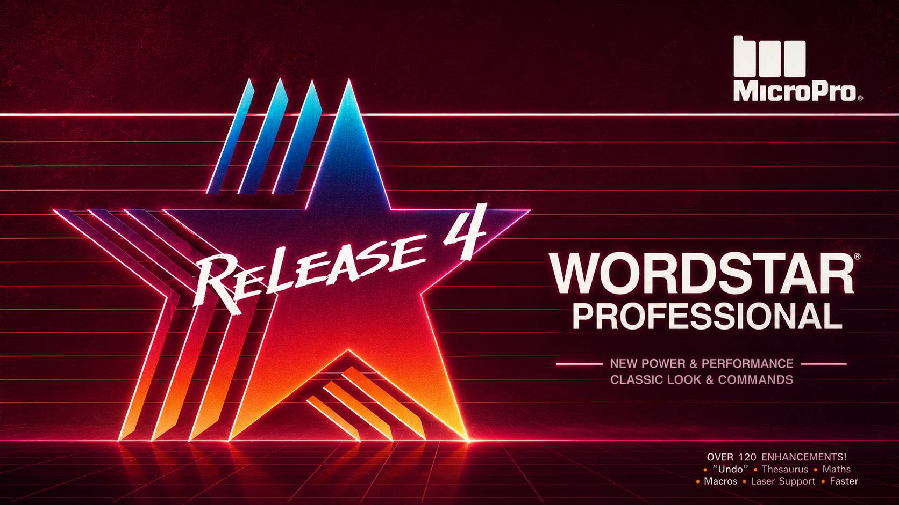
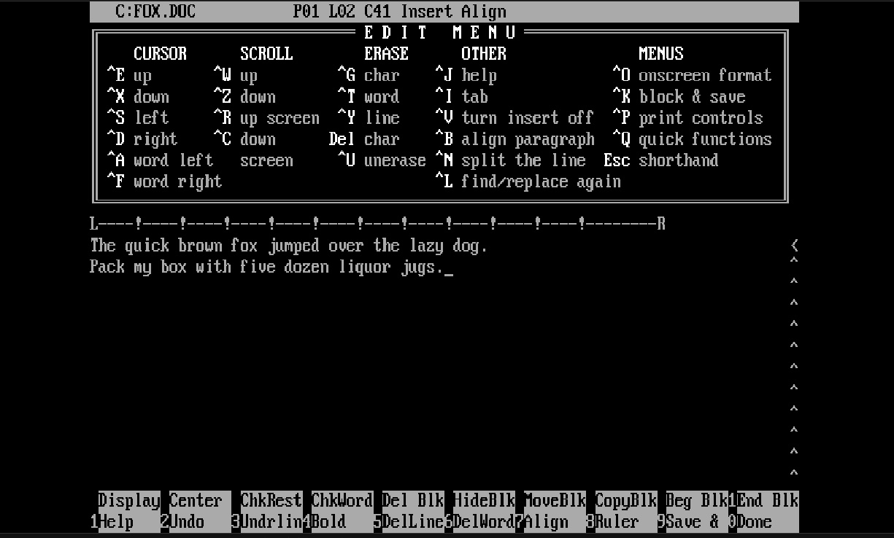

<div align="center">



# WordStar 4.0

### The real 1987 word processor. Your modern computer.

*The program George R. R. Martin still writes* A Song of Ice and Fire *in —*
*booting on macOS, Windows, and Linux with nothing to install.*

**[⬇️ Download](https://github.com/nampara-ai/wordstar/releases/latest) · [📖 Full manual](docs/MANUAL.md) · [⌨️ Cheat sheet](docs/QUICK-REFERENCE.md) · [🌐 Try it in your browser](https://nampara-ai.github.io/wordstar/)**

</div>

---

<div align="center">



<sub><i>WordStar 4.0 running today on a modern Mac — same screen, same keystrokes, the same 1987 binaries, unchanged.</i></sub>

</div>

This is not a clone, a tribute, or a rewrite. The files in [`ws4/`](ws4/) are the
**original, unmodified MicroPro WordStar Professional Release 4 binaries** from
1987. When you press `Ctrl‑K X`, the exact machine code that ran on an IBM PC/AT
saves your file.

WordStar is a 16‑bit MS‑DOS program, and no modern OS will run it directly
(Apple dropped 16‑bit code, 64‑bit Windows refuses DOS apps, Linux never spoke
DOS). So this repo wraps the originals in **DOSBox Staging** — *already bundled,
for all three platforms* — and gives you a single icon to click. **No install,
no setup, no internet required.**

| | What it is | Best for |
|---|---|---|
| 🖥️ **Desktop** | Double‑click a launcher → WordStar opens in a window. Your documents are real files in the `drive/` folder. | Actually writing. |
| 🌐 **Browser** | WordStar compiled to WebAssembly. Open a page, start typing. Nothing to install, ever. | Trying it instantly, on any device. |

Both run the *same* WordStar binaries.

---

## ⬇️ Install in 30 seconds

**Get the files:** clone this repo, or download the ZIP and unzip it. Then:

| Your computer | Double‑click this | Notes |
|---|---|---|
| 🍎 **macOS** | **`WordStar.command`** | First time: right‑click → **Open** to clear Gatekeeper (once). |
| 🪟 **Windows** | **`WordStar.bat`** | First time: SmartScreen → **More info → Run anyway** (once). |
| 🐧 **Linux** | **`WordStar.desktop`** *(or run `./wordstar.sh`)* | First time you may need to right‑click → *Allow Launching*. |

The first launch creates your personal **`drive/`** folder (that's your WordStar
disk — the program plus everything you write) and drops you at WordStar's
Opening Menu. After that, it just opens.

> **Then:** press **`D`** to create a document, type a name like `LETTER.DOC`,
> and start writing. Press **`Alt‑Enter`** for full screen. Save early and often
> with **`Ctrl‑K S`** — WordStar doesn't autosave.

That's the entire setup. **No DOSBox to install** — a private copy for your OS is
already in this folder. Everything runs **completely offline, forever.** (Got
`dosbox-staging` or `dosbox` on your `PATH` already? The launcher quietly uses
it instead.)

---

## ⌨️ The 30‑second crash course

WordStar predates the mouse — it's driven by **`Ctrl`‑key** commands (written
`^` here, so `^KS` means `Ctrl‑K` then `S`):

```
^KS   save, keep writing        ^KX   save and exit WordStar
^KD   save, back to the menu     ^KQ   quit WITHOUT saving
^Y    delete the whole line      ^T    delete the next word
^U    un‑erase (undo)            ^B    re‑flow a paragraph
arrows move the cursor           ^J    help        Alt‑Enter  full screen
```

From the Opening Menu, **`D`** opens or creates a document; **`P`** prints;
**`X`** exits to DOS. The bundled **`WELCOME.DOC`** walks you through the rest —
and the **[full manual](docs/MANUAL.md)** has ten lessons, every command, mail
merge, and troubleshooting.

**New here? → [Read the manual](docs/MANUAL.md).** It's genuinely good, and you'll
be fluent in half an hour.

---

## 🌐 The browser version

The truly zero‑install way — WordStar running in a web page:

```bash
cd web && python3 -m http.server 8000
# now open http://localhost:8000
```

WordStar boots straight into its Opening Menu. Your work autosaves *inside the
browser*; use the **floppy‑disk button** on the left edge to download documents
as real files. (It needs a small local server rather than a `file://`
double‑click, because browsers won't load WebAssembly off the bare filesystem.)
Every Ctrl‑key works here too — they're captured before the browser sees them.

---

## 📂 Where your writing lives

Everything you write is an ordinary text file in the **`drive/`** folder next to
the launcher (inside WordStar, that folder is drive `C:`):

```
drive/LETTER.DOC      ← what you wrote — open it in any modern editor
drive/LETTER.BAK      ← WordStar's automatic backup of your previous save
```

Deleted something you wanted? Your last save is sitting in the matching `.BAK`
file. File names are DOS‑style **8.3** (up to 8 characters, a dot, up to 3 —
`CHAPTER1.DOC`).

---

## 🔋 Zero dependencies, fully offline

The desktop launchers use **[DOSBox Staging](https://www.dosbox-staging.org/)**,
and you never install it — a copy for every OS is **committed right in this repo**
under [`native/bin/`](native/bin/README.md). Three ways it can get there:

1. **Already bundled** — clone or unzip and go; nothing to download.
2. **`scripts/fetch-dosbox.sh`** / **`.ps1`** — re‑stage or bump the version.
3. **`Build offline bundle`** GitHub Action — produces
   **`WordStar-4-portable.zip`** with DOSBox for all three OSes inside, for a
   download‑unzip‑doubleclick experience with no internet at all.

---

## 🚀 Publish the browser version (optional)

For a permanent, shareable URL:

1. Push this repo to GitHub.
2. **Settings → Pages → Source: GitHub Actions.**
3. The included [`pages.yml`](.github/workflows/pages.yml) workflow deploys
   `web/` to `https://<you>.github.io/<repo>/`.

---

## 🗂️ What's in here

```
ws4/                     Original WordStar 4 binaries (the real thing)
docs/MANUAL.md           ★ The full user manual — lessons, commands, troubleshooting
docs/QUICK-REFERENCE.md  One-page printable keyboard cheat sheet
docs/WELCOME.DOC         Friendly starter document (opens inside WordStar)
config/                  DOSBox configs (web + desktop)
web/                     Browser version (js-dos / DOSBox-WASM) + index.html
WordStar.command         macOS launcher        (double-click)
WordStar.bat             Windows launcher      (double-click)
WordStar.desktop         Linux launcher        (double-click)
wordstar.sh              Linux launcher        (terminal)
native/lib/              Launcher internals (find/fetch DOSBox, boot WordStar)
native/bin/              Bundled DOSBox per OS  (committed, runs offline)
scripts/                 fetch-dosbox.*, build-web.sh, make_jsdos.py
.github/workflows/       bundle.yml (offline zip) + pages.yml (browser site)
```

Rebuilt the browser bundle after changing `ws4/`? Run `scripts/build-web.sh`.

---

## 📜 Notes & licensing

- **WordStar** is the property of its respective rights holders. These binaries
  are widely distributed as abandonware; this project adds only the wrapping to
  run them and claims no ownership of WordStar itself.
- **DOSBox Staging** is GPL‑licensed and bundled from its official releases.
- The browser version uses **[js‑dos](https://js-dos.com)** (DOSBox compiled to
  WebAssembly), also GPL‑licensed; its files live under `web/`.
- The wrapper code in this repo (launchers, scripts, web glue, docs) is
  **[MIT-licensed](LICENSE)** — free for you to use and adapt. Bundled WordStar
  and DOSBox Staging retain their own licenses (noted above).

<div align="center">

---

*“It is 1987 again. Have fun.”*

</div>
